# 🍱 The Umai Knowledge Standard (UKS)

> *"Tasty Knowledge. Structured Growth."*
> *"Umai!" (Delicious!)*

[](https://opensource.org/licenses/MIT)
[](http://makeapullrequest.com)

**UKS** is a universal protocol for **"cooking" raw information into high-density, nutritious knowledge assets**.
It bridges the gap between **Human Readability** and **AI Consumability**.

---

## 🏛️ Architecture & Flow

UKS transforms your scattered notes into a semantic **Knowledge Graph** (The Brain).

```mermaid
graph TD
    subgraph Input ["🍱 The Kitchen (Knowledge Base)"]
        Raw[Raw Info] -->|Distill| JSON["Bento Box (.json)"]
        JSON -->|Schema Check| Valid{"Valid Umai?"}
    end

    subgraph Core ["👨‍🍳 The Chef (CLI Engine)"]
        Valid -->|uks cook| Indexer[Graph Indexer]
        Indexer -->|Builds| GraphDB[("Knowledge Graph (.jsonl)")]
    end

    subgraph Output ["🍽️ Serving (Consumption)"]
        GraphDB -->|Search| AI[🤖 AI Agent]
        GraphDB -->|Visualize| Human[👤 Human Architect]
    end

    style Input fill:#e1f5fe,stroke:#01579b
    style Core fill:#fff9c4,stroke:#ff6f00
    style Output fill:#f1f8e9,stroke:#33691e
```



## 🧘 Design Philosophy

### 1. AI-First, Human-Friendly
Most documentation is written for humans (prose, fluff, ambiguity). AI struggles to extract the "meat" from the "soup".
**UKS forces Density.**
- **No Prose:** Concepts are broken down into atomic JSON fields.
- **No Fluff:** Only the "Nutrition" (Facts, Patterns, Code) is stored.

### 2. The Bento Box Model (Modular Knowledge)
Knowledge should be modular, like a Bento Box.
- **Dish:** The Concept Name.
- **Flavor:** The Type (Pattern, Tool, Principle).
- **Ingredients:** Dependencies (Links to other boxes).
- **Nutrition:** The Core Value payload.

### 3. Graph Over Hierarchy
File folders are rigid. Knowledge is fluid.
UKS uses **Links (`ingredients`)** to build a dynamic graph.
- *Dependency Injection* is an ingredient of *NestJS*.
- *Event Loop* is an ingredient of *Node.js*.

---

## 📦 The Schema (Recipe)

Every knowledge asset must follow the **UKS Standard Schema**:

```json
// filename: snake_case.json
{
  "dish": "Concept Name",
  "flavor": "Concept | Pattern | Tool | Architecture",
  "taste_notes": "One sentence summary.",
  "ingredients": [ "dependency_1", "dependency_2" ], // Semantic Links
  "nutrition": {
     // Structured payload
     "pros": [],
     "cons": []
  }
}
```

---

## 🛠️ Usage (The Chef's Tools)

### Installation
```bash
git clone https://github.com/fmw666/UKS.git
./install.sh
```

### Cooking (Indexing)
```bash
# Scan your kitchen and build the graph
uks cook
```

### Serving (Querying)
```bash
# Ask the chef
uks search "Dependency Injection"
```

---

## 🌍 Why Umai?
| Feature | Traditional Docs (Markdown) | UKS (Bento JSON) |
| :--- | :--- | :--- |
| **Parsing Speed** | Slow (Natural Language Processing) | **Instant** (JSON Parse) |
| **Ambiguity** | High | **Zero** |
| **Linking** | Hyperlinks (Weak) | **Graph Edges** (Strong) |
| **Maintenance** | Hard to Refactor | **Easy to Validate** |

---

*Maintained by the Flame Hashira Architecture Team* 🔥
